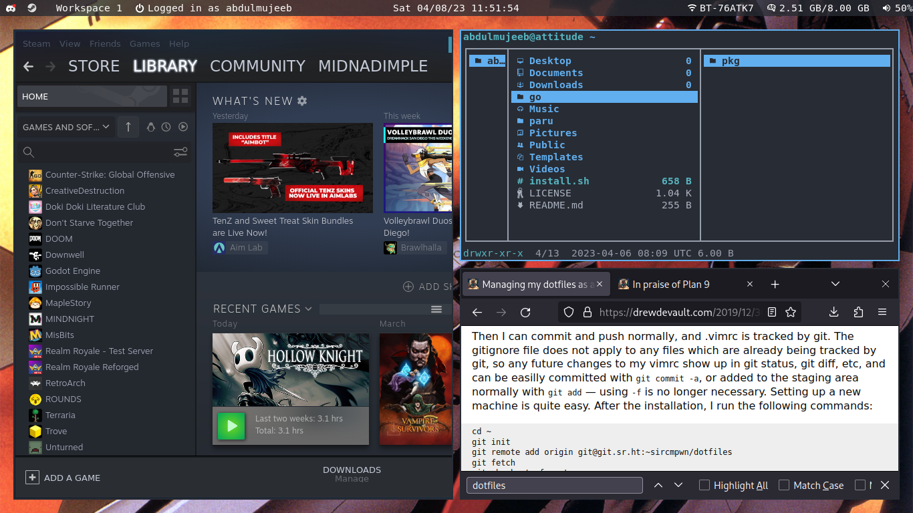

# dotfiles




Only works on Arch with Pipewire and NetworkManager.

To install:

```
cd ~
git init
git remote add origin git@github.com:midnadimple/dotfiles
git fetch
git checkout -f master
./install.sh
touch ~/.config/hypr/custom.conf # needed for custom config and proper operation
```

Logout and login.

Any scripts you want to install, place in `.local/bin`

Licensed under [MIT](LICENSE)
